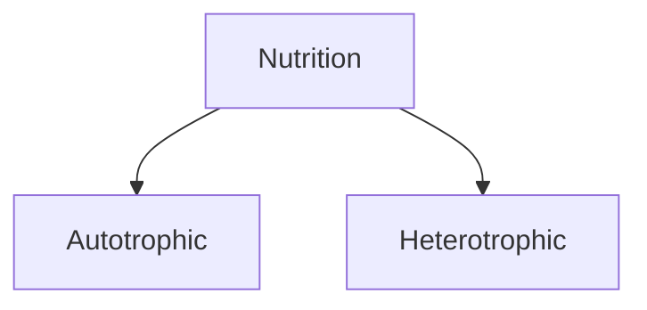
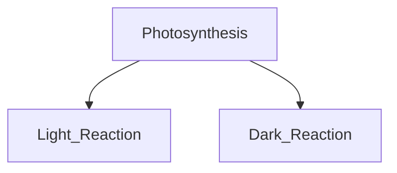

#### Table Of Contents
- ~={yellow}[[#Nutrition|Nutrition]]=~
	- ~={orange}[[#Nutrition#Photosynthesis|Photosynthesis]]=~
	- ~={orange}[[#Nutrition#Where Do Plants Get Raw Materials?|Where Do Plants Get Raw Materials?]]=~
	- ~={orange}[[#Nutrition#Chlorophyll & Chloroplast|Chlorophyll & Chloroplast]]=~
	- ~={orange}[[#Nutrition#Photosynthesis - 2 Reactions|Photosynthesis - 2 Reactions]]=~
	- ~={orange}[[#Nutrition#Basic Events of Photosynthesis|Basic Events of Photosynthesis]]=~
	- ~={orange}[[#Nutrition#Stomata & Heterotrophic Nutrition|Stomata & Heterotrophic Nutrition]]=~
	- ~={orange}[[#Nutrition#Heterotrophic Nutrition|Heterotrophic Nutrition]]=~
	- ~={orange}[[#Nutrition#Saprotrophic|Saprotrophic]]=~
	- 

- All the processes which help to maintain the life of an organism is called~={yellow} ==Life Processes===~
> [!example]+ Example
> Nutrition, Respiraton, Circulation / Transportation excretion

---
## Nutrition
> It is the process of obtaining ~={orange}nutrients=~. 

It is of ~={cyan}==2 types===~ :
- Autotrophic
- Heterotrophic

<h3>Autotrophic</h3>

Autotropic nutrition is the type of nutrition in which organisms prepare their own food

> [!important]
> It is derived from 2 words :
>            * 'Auto' meaning Self 
>            * 'Troph' related to food

![[Pasted image 20260326192618.png]]

---

### Photosynthesis

> [!question]
> Why are green plants also known as Autotrophs or Producers?

> Because they prepare their own food
---

![[Pasted image 20260326204937.png]]

> [!question] What are the raw materials used for photosynthesis?
> Carbondioxide, water, minerals, chlorophyll, sunlight

---
### Where Do Plants Get Raw Materials?

> [!note]
> From where do plants get these raw materials?

| Raw Materials                                                                    | Source      | Entry Via  |
| -------------------------------------------------------------------------------- | ----------- | ---------- |
| ==CO2==                                                               | Atmosphere  | Stomata    |
| <mark style="background:rgba(3, 135, 102, 0.2)">H2O & Minerals</mark> | Soil        | Roots      |
| <mark style="background:rgba(240, 200, 0, 0.2)">Sunlight</mark>                  | Sun         | Leaves     |
| <mark style="background:rgba(3, 135, 102, 0.2)">Chlorophyll</mark>               | Chloroplast | ---------- |
> Ultimate Source of Energy - <mark style="background:rgba(240, 200, 0, 0.2)"> SUN</mark> 
---
### Chlorophyll & Chloroplast

- Green colour pigment in plants - <mark style="background:rgba(3, 135, 102, 0.2)">Chlorophyll</mark>
- **Food Factory** of plants - <mark style="background:rgba(3, 135, 102, 0.2)">Leaf</mark>
- **Food Producing Organelle** - <mark style="background:rgba(3, 135, 102, 0.2)">Plastid(Chromoplast) = Chloroplast</mark>

![[Pasted image 20260326204902.png]]

---

### Photosynthesis - 2 Reactions

![[Pasted image 20260326204726.png|697]]

---

### Basic Events of Photosynthesis
### $$6CO_{2} + 6H_{2}O \xrightarrow[\text{chlorophyll}]{\text{sunlight}} C_{6}H_{12}O_{6} + 6O_{2}$$
---

### Stomata & Heterotrophic Nutrition

> Opening and closing of stomata is regulated by **Guard Cells**

> [!question] Stomata closes when it does not need _____________?
> Carbon dioxide

---
### Heterotrophic Nutrition

![[Pasted image 20260326210441.png]]

---
### Saprotrophic 

> [!info] Saprotrophic Organisms take their food from decaying matter.
> e.g: Saprotrophs / Saprophytes take their food from dead and decaying matter

### hello
